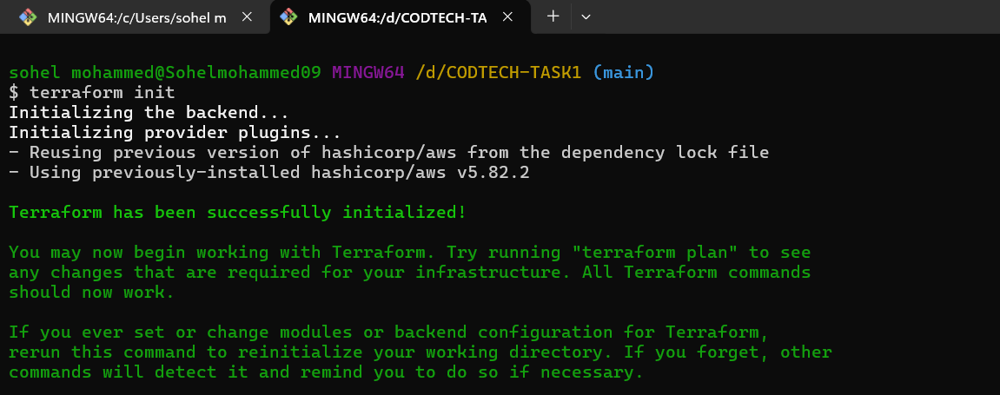
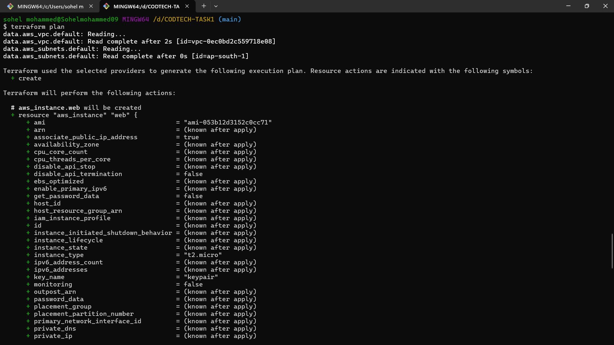
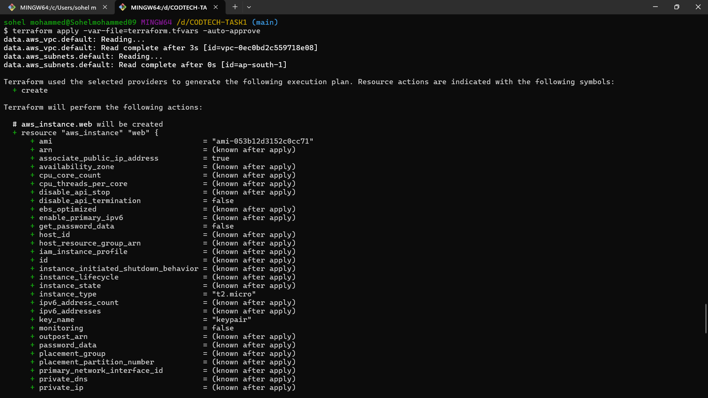
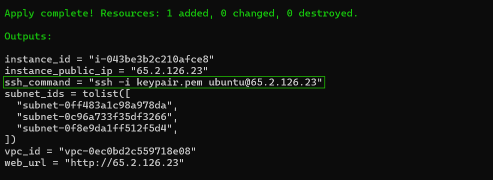
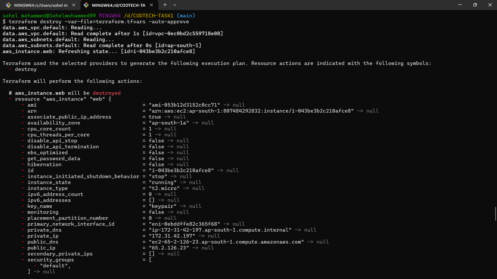

# AWS Dynamic EC2 Template

**NAME : MOHAMMED SOHEL PASHA** <br>
**COMPANY : CODTECH IT SLOUTIONS** <br>
**ID : CT08EHX** <br>
**DOMAIN : DEVOPS** <br>
**DURATION : DEC - JAN 2025**

## Overview
The **AWS Dynamic EC2 Template** is designed to simplify the process of creating and managing EC2 instances on AWS using Terraform. This template allows users to dynamically configure EC2 instances by passing customizable parameters through a `.tfvars` file, ensuring flexibility and reusability across various use cases. The output includes essential details such as an SSH command for easy access to the instance, public IPs, and more.

This project is ideal for DevOps professionals, cloud engineers, and developers looking for an efficient way to manage EC2 infrastructure.

---

## Features

1. **Dynamic Configuration**
   - Accepts user inputs for instance types, AMIs, security groups, and more through the `.tfvars` file.

2. **SSH Access**
   - Outputs an SSH command in the format `ssh -i <ssh_key> username@public_ip` for easy instance access.

3. **Reusable and Modular**
   - Can be integrated into larger Terraform projects or used standalone.

4. **Comprehensive Outputs**
   - Provides details like:
     - Public and private IP addresses
     - Instance IDs
     - SSH commands

5. **Simplified Infrastructure Management**
   - Supports tagging, allowing easy identification and management of resources.

---

## Usage

### Prerequisites
- Terraform installed ([Download Terraform](https://www.terraform.io/downloads.html))
- AWS CLI configured with appropriate credentials ([AWS CLI Configuration Guide](https://docs.aws.amazon.com/cli/latest/userguide/cli-configure-quickstart.html))
- SSH key pair available for accessing instances

### Steps to Use the Template

1. **Clone the Repository**
   ```bash
   git clone https://github.com/sohelmohammed0/CODTECH-TASK1.git
   cd CODTECH-TASK1
   ```

2. **Configure Inputs**
   - Edit the `variables.tf` file to define default values for the required variables.
   - Create a `terraform.tfvars` file and populate it with your desired configuration.

3. **Initialize Terraform**
   ```bash
   terraform init
   ```
   Initializes the working directory by downloading the necessary provider plugins and preparing the environment.


4. **Plan the Deployment**
   ```bash
   terraform plan
   ```
Creates an execution plan showing the actions Terraform will take.


   - Review the output to verify the resources to be created.

5. **Apply the Configuration**
   ```bash
   terraform apply -var-file=terraform.tfvars -auto-approve
   ```
   Applies the changes to create or modify infrastructure as per the configuration.

   
6. **Access the Instance**
   - Copy the SSH command from the Terraform output to access the instance.


7. **Clean Up**
   - To destroy all created resources:
     ```bash
     terraform destroy
     ```
Displays useful outputs from the configuration, such as public IP addresses or SSH commands.


---

## Advantages

- **Efficiency:** Automates the tedious process of setting up EC2 instances manually through the AWS Management Console.
- **Scalability:** Easily replicate and scale configurations for multiple instances.
- **Flexibility:** Allows dynamic customization for various deployment scenarios.
- **Cost-Effective:** Optimizes resource management by using Terraform to manage lifecycle events.
- **Ease of Use:** Clear instructions and dynamic outputs simplify instance management for both beginners and advanced users.

---

## Contribution
Contributions are welcome! If you have ideas to enhance the template, feel free to open an issue or submit a pull request.

---

## License
This project is licensed under the MIT License. See the `LICENSE` file for more details.

---

## Contact
For any questions or support, please reach out to [sohel879879@gmail.com].
